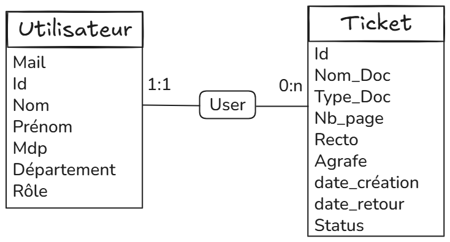
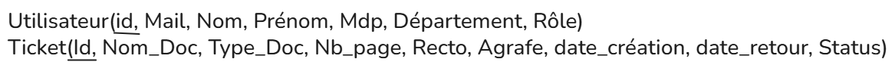

# Stage 2026 - Database

  
Ce document décrit la base de données, notamment ses collections, ses vues, ses utilisateurs et leurs droits.

Ce document est complété par divers schémas illustrant les relations entre les différents éléments.

   

- ### [I - Analyse](#p1)

- ### [II - CDM](#p2)
  - Pour chaque Collection
    - Le nom de la Collection
    - La description de la Collection

- ### [III - LDM](#p3)

---------

##  I - Analyse

Pour ce projet, la base de données devra stocker les utilisateurs ainsi que leurs demandes de reprographie.

Les données seront stockées dans différentes collections.

Une relation logique existera entre les utilisateurs et les tickets, un utilisateur pouvant posséder plusieurs tickets.

La base de données devra être sécurisée afin d’empêcher tout accès non autorisé. Les utilisateurs ne pourront accéder qu’à leurs propres données.

## II – CDM

  

**Collection `UTILISATEUR` :**

La collection `Utilisateur` a pour rôle de stocker les informations des utilisateurs de la plateforme ainsi que leurs rôles.

La collection `Utilisateur` contiendra les champs suivants :
- `Id` : Champ contenant l'identifiant de l'utilisateur. C'est l'ObjectId de la collection.
- `Mail` : Champ contenant le mail de l'utilisateur.
- `Nom` : Champ stockant le nom de l'utilisateur.
- `Prénom` : Champ stockant le prénom de l'utilisateur.
- `Mdp` : Champ contenant le mot de passe de l'utilisateur, utilisé pour la connexion.
- `Département` : Champ contenant le département de l'utilisateur. Contrainte sur une liste définie de possibilités.
- `Role` : Champ contenant le rôle de l'utilisateur. Contrainte sur une liste définie de possibilités.

**Exemple de document pour la collection Utilisateur :**

{ 
  - "_id": "ObjectId",
  - "mail": "user@mail.com",
  - "nom": "Dupont",
  - "prenom": "Jean",
  - "password": "hash_password",
  - "departement": "INFO",
  - "role": "Utilisateur"
}

  

**Collection `Ticket` :**

La Collection `Ticket` a pour rôle de stocker les informations des requêtes réalisées par les utilisateurs.

La Collection `Ticket` contiendra les colonnes suivantes :
- `Id` : Identifiant unique pour chaque ticket. l'ObjectId de la Collection.
- `Nom_Doc` : Champ stockant le nom du document déposé.
- `Type_Doc` : Champ stockant le type du document déposé.
- `Nb_page` : Champ stockant le nombre de pages du document déposé
- `Nb_exemplaire` : Champ stockant le nombre d'exemplaires du document
- `Recto` : Champ contenant un boolean indiquant si le document doit être imprimé Recto-Verso ou seulement Recto
- `Agrafe` : Champ stockant un boolean indiquant si le document doit être attaché avec des agrafes ou non
- `date_creation` : Champ stockant une date indiquant le moment de la création du ticket
- `date_retour` : Champ stockant une date indiquant la date limite du ticket
- `Status` : Champ stockant l'état du ticket. Restrainte sur une liste définie de possibilités
- `User` : Champ stockant une référence au champ "_id" de la Collection "Utilisateur", elle indique quel utilisateur est associé à la requête.
- `Reprographe` : Champ stockant une référence au champ "_id" de la Collection "Utilisateur", elle indique quel Reprographe est associé à la requête.
- `Position_Fichier` : Champ stockant la position du fichier dans le serveur.

**Exemple de document pour la collection `Ticket` :**

{
  - "_id": "ObjectId",
  - "nom_doc": "rapport.pdf",
  - "type_doc": "pdf",
  - "nb_pages": 10,
  - "nb_exemplaire":10,
  - "recto_verso": true,
  - "agrafe": false,
  - "date_creation": "2026-02-10",
  - "date_retour": "2026-02-15",
  - "status": "Ouvert",
  - "user_id": "ObjectId",
  - "Reprographe" : "ObjectId"
  - "Position_Fichier" : "C:/Application/File/"
}

**Collection `Annexes` :**

La Collection Annexes a pour rôle de stocker les listes pouvant varier de valeurs telles que la liste des Départements ou la liste des extensions possibles pour les fichiers.

La Collection Annexes contiendra les colonnes suivantes :
- `Id` : Identifiant unique pour chaque Annexe. l'ObjectId de la Collection.
- `Nom_Liste` : Champ stockant le nom de la liste.
- `Valeur` : Champ stockant une liste.

 **Exemple de document pour la collection Annexes :** 

{
  - "_id": "ObjectId",
  - "Nom_Liste": "Département",
  - "Valeur": ["INFO","GEII","MMI","RT"],
}

  

<b> Relation entre les Collections :</b>

La relation entre les collections Utilisateur et Ticket est de type un-à-plusieurs :

Un utilisateur peut créer plusieurs tickets, mais un ticket appartient à un seul utilisateur.

Cette relation est représentée par le champ user dans la collection Ticket, qui référence l’identifiant id d’un utilisateur.

  

<i>Figure 1: Diagramme CDM.</i>

## III – LDM
  

<i>Figure 2: diagramme Mld.</i>

