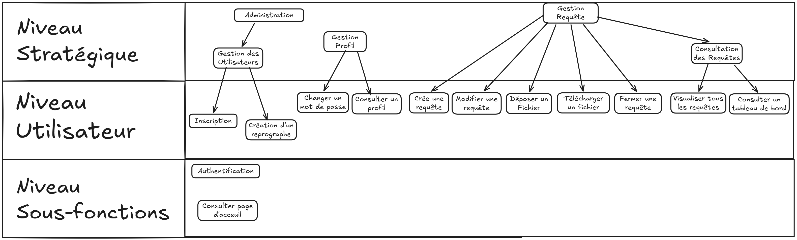

# Stage 2026 - Recueil des besoins

## Sommaire

### [I – Objectif et portée](#p1)
- <b>[a) Quel est le champ d'application et les objectifs généraux ?](#p1a)</b>
- <b>[b) Examen du cahier des charges](#p1b) </b>
- <b>[c) Diagrammes et graphiques visuels](#p1c) </b>
### [II – Terminologie / Glossaire](#p2)
### [III – Cas d’utilisation](#p3)
- <b>[a) Principaux acteurs et leurs objectifs généraux](#p3a)</b>
- <b>[b) Cas d'utilisation stratégiques](#p3b)</b>
- <b>[c) Cas d'utilisation utilisateur](#p3c)</b>
- <b>[d) Cas d'utilisation du système](#p3d)</b>
### [IV – Technologies employées](#p4)
- <b>[a) Quelles sont les exigences technologiques de ce système ?](#p4a)</b>
- <b>[b) Avec quels systèmes ce système interagira-t-il, et avec quelles exigences ?](#p4b)</b>
### [V – Autres exigences](#p5)
- <b>[a) Processus de développement](#p5a)</b>
    - <b>[i. Qui sont les participants au projet ?](#p5ai)</b>
    - <b>[ii. Quelles valeurs doivent être privilégiées ? (par exemple, simplicité, disponibilité, rapidité, flexibilité, etc.)](#p5aii)</b>
    - <b>[iii. Quels retours d'information ou quelle visibilité les utilisateurs et les sponsors attendent-ils sur le projet ?](#p5aiii)</b>
    - <b>[iv. Quelles sont les autres exigences du processus ? (par exemple, tests, installation, etc.)](#p5aiv)</b>
    - <b>[v. Quelles sont les dépendances du projet ?](#p5av)</b>
- <b>[b) Performance](#p5b)</b>
- <b>[c) Opérations, sécurité, documentation](#p5c)</b>
- <b>[d) Facilité d'utilisation et convivialité](#p5d)</b>
- <b>[e) Maintenance et portabilité](#p5e)</b>
### [VI – Ressources humaines, questions juridiques, politiques et organisationnelles](#p6)
- <b>[a) Quelles sont les exigences légales et politiques ?](#p6a)</b>
- <b>[b) Quels sont les besoins en formation ?](#p6b)</b>
- <b>[c) Quelles hypothèses et dépendances affectent l'environnement humain ?](#p6c)</b>

 

---

### I – Objectif et portée

- #### a) Quel est le champ d'application et les objectifs généraux ?

  - **Objectives:**
    - Développer une application web permettant aux utilisateur d'utiliser un service de reprographie.
    - S’assurer que le système est sécurisé, maintenable et évolutif, et conforme au RGPD et aux autres réglementations applicables.
      
  - **Scope:**
    - **Inclusion:**
      - Conception et mise en œuvre d'une interface web permettant aux utilisateurs de soumettre des documents et visualiser leur état.
      - Mise en œuvre de l'authentification des utilisateurs, de la gestion des sessions et des contrôles d'administration pour la supervision du système.
      - Mesures de conformité en matière de protection des données et de respect de la vie privée selon le RGPD.

    - **Exclusion:**
      - Intégration avec d'autres services tiers non mentionnés dans les exigences techniques.
      - La version en ligne de la plateforme n'est pas prévue pour cette version.
      - Prise en charge des navigateurs anciens (par exemple, Internet Explorer).

    <a href="#Sommaire">⮐ retour au Sommaire</a>

- #### b) cahier des charges du projet

  - **Project Importance:**
    - Ce projet vise à fournir une solution pratique pour réaliser des demandes de reprographie.
    
  - **Résultats attendus:**
    - Une plateforme web entièrement fonctionnelle qui récupère et traite des demandes de reprographie de fichiers.
    - Des fonctionnalités améliorées de sécurité et de gestion des utilisateurs qui protègent les données des utilisateurs et garantissent l'intégrité et la fiabilité du système.
    

    <a href="#Sommaire">⮐ retour au Sommaire</a>

- #### c) Diagrammes et graphiques visuels

  - **Diagramme descriptif des niveaux :** Représentation visuelle de l’architecture du système, montrant comment les différents composants interagissent et comment les données circulent dans le système.
  - **Diagramme de cas d'utilisation :** illustre les interactions entre les utilisateurs (administrateurs et utilisateurs finaux) et le système, en mettant en évidence les principales fonctionnalités et les flux de contrôle.

**Diagramme à ajouter** 

    

    <a href="#Sommaire">⮐ retour au Sommaire</a>

---

### II – Terminology / Glossary

| Words                | Definition                                                                                                                                                                                  |
|:---------------------|:--------------------------------------------------------------------------------------------------------------------------------------------------------------------------------------------|
| Reprographie         | Ensemble des procédés permettant la duplication de documents |
| CNIL                 | Commission nationale pour l'informatique et les libertés (CNIL). Autorité administrative française indépendante chargée de veiller à ce que les technologies de l'information soient au service du citoyen. |
| Échec de la tentative de connexion | L'échec d'une tentative de connexion à un système ou à un compte utilisateur en raison d'informations incorrectes ou d'un problème technique.                                                                           |
| Cookie               | (En informatique) : Un petit fichier stocké par un serveur sur l'appareil d'un utilisateur (ordinateur, téléphone, etc.) et associé à un domaine web.                                                            |
| Demande d'assistance      | Une demande soumise par un utilisateur pour signaler un problème ou une difficulté technique nécessitant une intervention ou une résolution (ticket) de la part de l'équipe de support informatique.                                       |
| Injection SQL        | Une technique permettant d'injecter des éléments SQL dans les champs de formulaires Web ou les liens de pages, dans le but de les envoyer au serveur Web pour modifier des éléments dans une base de données.                             |
| Labels               | Étiquettes ou mots-clés attribués à un ticket informatique pour catégoriser, organiser et faciliter la recherche de problèmes ou de demandes d'assistance similaires.                                                        |
| RGPD                 | Règlement général sur la protection des données (RGPD). Texte de référence en matière de protection des données personnelles. Il renforce et harmonise la protection des données des personnes physiques au sein de l'Union européenne.                   |
| SGBD                 | Système de gestion de bases de données.                                                                                                                                                                 |
| Assistance informatique          | Assistance technique qui traite les demandes de support, résout les problèmes techniques et répond aux questions liées aux technologies de l'information.                                                                    |
| Tableau de bord            | Une interface en ligne affichant des informations récapitulatives et des données clés pour aider les utilisateurs à surveiller et gérer les opérations liées aux tickets et au support informatique..                                           |
| W3C                  | Consortium World Wide Web (W3C). Une organisation internationale qui définit les normes techniques du Web et les règles que tous les développeurs du monde entier doivent respecter.                                      |
| Wave                 | Une extension de navigateur qui évalue l'accessibilité d'une page web pour les personnes handicapées.                                                                                            |

 

    <a href="#Sommaire">⮐ retour au Sommaire</a>

---

### III – Cas d’utilisation

- **a) Les principaux acteurs et leurs objectifs.**

    - <u>Le visiteur (un ou plusieurs) </u>
        > - S’inscrit / Crée un compte
        > - Accéder à la page d'accueil

   

  Pour différencier un utilisateur d'un visiteur, les visiteurs doivent s'inscrire et remplir un formulaire pour devenir des utilisateurs.
    
    - <u>L'utilisateur (un ou plusieurs) :</u>
        > - Se connecte, se déconnecte
        > - Créer une demande de reprographie
        > - Accède à leur histoire
        > - Consulter l'historique
    
   

    - <u>Le reprographe (un ou plusieurs) :</u>
        > - Est un utilisateur, mais avec des droits d'administrateur supplémentaires
        > - Voir toutes les demandes réalisées par les utilisateurs
        > - Télécharger des documents
        > - Changer l'état d'une demande (En attente -> Préparation -> Finie)

   

    - <u>L'administrateur (seulement un) :</u>
        > - Est un utilisateur, mais avec des droits d'administrateur supplémentaires
        > - Configurer le serveur
        > - Modifier la base de données

    <a href="#Sommaire">⮐ retour au Sommaire</a>

- **b) Cas d'utilisation stratégiques.**

#### Cas d'utilisation 1 : Administration
**Nom :** Administration  
**Contexte d'utilisation :** La plateforme doit permettre aux administrateurs de gérer les éléments.  
**Portée :** Organisation boîte noire  
**Niveau :**  Stratégique  
**Acteur principal :** Administrateur  
**Précondition :** Administrateur est connecté  
**Garanties en cas de succès :** Modification des données   
**Garanties minimales :** Aucune modification effectuée  
**Déclencheur :** Besoin de modifier les données de la plateforme  
**Scénario nominal :**
1. L'administrateur accède aux données
2. Les données sont modifiées par l'administrateur

**Exception :**

1. Impossible d'accéder à la base de données
    - Un message d'erreur est envoyé à l'utilisateur pour échec d'accès à la base de données (ÉCHEC).

2. Erreur durant la modification :
    - Envoi d'un message d'échec de modification (ÉCHEC)
***

#### Cas d'utilisation 2 : Gestion des Utilisateurs
**Nom :** Gestion des Utilisateurs  
**Contexte d'utilisation :** La plateforme doit permettre aux administrateurs de gérer les comptes utilisateurs.  
**Portée :** Organisation boîte blanche  
**Niveau :**  Stratégique  
**Acteur principal :** Administrateur  
**Précondition :** Administrateur est connecté  
**Garanties en cas de succès :** Création d'un compte utilisateur   
**Garanties minimales :** Les données entrées ne sont pas stockées  
**Déclencheur :** Une demande de création d'utilisateur est réaliser  
**Scénario nominal :**
1. Une demande de création de compte est reçue
2. Accès à la base de données
3. Création d'un nouveau compte utilisateur

**Exception :**

1. Les champs obligatoires du formulaire ne sont pas tous remplis :
    - Un message d'erreur est envoyé pour la création d'un compte (ÉCHEC)

2. Impossible d'accéder à la base de données :
    - Un message d'erreur est envoyé pour la création d'un compte (ÉCHEC)

3. Une erreur est arrivée durant la création du compte
    - Un message d'erreur est envoyé pour la création d'un compte (ÉCHEC)

***
#### Cas d'utilisation 3 : Gestion Profil
**Nom :** Gestion Profil  
**Contexte d'utilisation :** Un utilisateur possédant un compte inscrit souhaite consulter ses informations, changer et/ou récupérer son mot de passe.  
**Portée :** Système boîte noir  
**Niveau :**  Stratégique  
**Acteur principal :** Utilisateur  
**Précondition :** Un utilisateur est connecté  
**Garanties minimales :** Les données seront privées et le mot de passe est masqué   
**Déclencheur :** Événement interne concernant le profil d'un utilisateur  
**Scénario nominal :**
1. Accéder à la base de données
2. Extraire les informations du compte
3. Gérer la demande de l'utilisateur

**Exception :**

1. Impossible d'accéder à la base de données :
    - Afficher une erreur. (ÉCHEC)
***
#### Cas d'utilisation 4 : Gestion requête
**Nom :** Gestion requête  
**Contexte d'utilisation :**  La plateforme doit permettre de gérer et afficher des demandes de reprographie.  
**Portée :**  Organisation boîte noire 
**Niveau :**  Stratégique  
**Acteur principal :** Utilisateur  
**Précondition :**  Utilisateur connecté  
**Garanties minimales :** Possibilité de créer des requêtes de reprographie  
**Déclencheur :** Requête de l'utilisateur  
**Scénario nominal :**  
1. L'utilisateur réalise une demande (créer, voir, modifier)
2. Une interaction avec la base de données a lieu

**Exception :**

1. La demande n'a pas fonctionné
    - Un message d'erreur est affiché indiquant l'erreur

2. L'affichage a échoué
    - Un message d'erreur est affiché

***

#### Cas d'utilisation 5 : Consultation des requêtes
**Nom :** Consultation des requêtes  
**Contexte d'utilisation :**  Un utilisateur réalise une demande pour voir les requêtes  
**Portée :** Système boîte noir  
**Niveau :** Stratégique   
**Acteur principal :** Utilisateur  
**Précondition :** Utilisateur doit être connecté  
**Garanties en cas de succès :** Un tableau est affiché contenant les informations   
**Déclencheur :** Demande de l'utilisateur pour voir les requêtes  
**Scénario nominal :**  
1. L'utilisateur fait une demande
2. Une interaction a lieu avec la base de données
3. Le résultat est affiché

**Exception :**

1. Impossible d'accéder à la base de données :
    - Afficher une erreur (ÉCHEC)

    <a href="#Sommaire">⮐ retour au Sommaire</a>

---

- <b>c) Cas d'utilisation utilisateurs.</b>

#### Cas d'utilisation 6 : Inscription
**Nom :** Inscription  
**Contexte d'utilisation :** Un nouvel utilisateur voudrait créer un compte  
**Portée :** Système boîte noir  
**Niveau :**  Utilisateur  
**Acteur principal :** Utilisateur  
**Précondition :** l'utilisateur ne doit pas être connecté  
**Garanties en cas de succès :** Un nouveau compte utilisateur est créé   
**Garanties minimales :**  Les données seront privées et le mot de passe encrypté  
**Déclencheur :** Un formulaire de création de compte est donné au système par le nouvel utilisateur  
**Scénario nominal :**  
1. Réception d'un formulaire de création d'utilisateur
2. Encriptage du mot de passe donné dans le formulaire
3. Insertion d'une valeur dans la base de données
4. Affichage d'un message de validation de création de compte

**Exception :**

1. L'utilisateur n'a pas remplt tous les champs obligatoires du formulaire :
    - Envoi d'un message d'échec de création de compte à l'utilisateur (ÉCHEC)

2. Le login de l'utilisateur est déjà présent dans la base de données :
    - Envoi d'un message d'échec de création de compte à l'utilisateur (ÉCHEC)
    
3. Impossible d'accéder à la base de données :
    - Envoi d'un message d'échec de création de compte à l'utilisateur (ÉCHEC)
***

#### Cas d'utilisation 7 : Création d'un reprographe
**Nom :** Création d'un reprographe  
**Contexte d'utilisation :** L'administrateur crée un nouveau compte reprographe 
**Portée :** Système boîte noir  
**Niveau :** Utilisateur   
**Acteur principal :** Administrateur  
**Précondition :** Adminstrateur est connecté à son compte  
**Garanties en cas de succès :** Un nouveau compte reprographe est créé  
**Garanties minimales :** Les données seront privées et le mot de passe encrypté  
**Déclencheur :** Administrateur fait une demande de création d'un compte reprographe  
**Scénario nominal :**  
1. Réception d'un formulaire de création d'utilisateur
2. Encriptage du mot de passe donné dans le formulaire
3. Insertion des valeurs dans la base de données
4. Affichage d'un message de validation de création de compte

**Exception :**

1. L'utilisateur n'a pas rempli tous les champs obligatoires du formulaire :
    - Envoi d'un message d'échec de création de compte à l'utilisateur (ÉCHEC)
2. Le login de l'utilisateur est déjà présent dans la base de données :
    - Envoi d'un message d'échec de création de compte à l'utilisateur (ÉCHEC)   
3. Impossible d'accéder à la base de données :
    - Envoi d'un message d'échec de création de compte à l'utilisateur (ÉCHEC)
***

#### Cas d'utilisation 8 : Changer de mot de passe
**Nom :** Changer de mot de passe  
**Contexte d'utilisation :** Un utilisateur fait une demande de changement de mot de passe  
**Portée :** Système boîte blanche  
**Niveau :** Utilisateur  
**Acteur principal :** Utilisateur  
**Précondition :** Utilisateur est connecté à son compte  
**Garanties minimales :** Les données seront privées, le mot de passe encrypté et le mot de passe n'est pas modifié  
**Déclencheur :** Une demande est réalisée et envoyée par l'utilisateur  
**Scénario nominal :**  
1. Le système reçoit un formulaire de modification de mot de passe
2. Une interaction a lieu avec la base de données
3. Vérification des informations du formulaire avec celles contenues dans la base de données
4. Changement du mot de passe entre l'ancien et le nouveau dans la base de données
5. Affichage d'un message de validation du changement de mot de passe

**Exception :**

1. L'utilisateur n'a pas rempli tous les champs obligatoires du formulaire :
    - Envoi d'un message d'échec de changement de mot de passe (ÉCHEC)
2. Impossible d'accéder à la base de données :
    - Envoi d'un message d'échec de changement de mot de passe (ÉCHEC)
3. Le login de l'utilisateur n'est pas dans la base de données :
    - Déconnexion de la session
4. Le mot de passe renseigné n'est pas validé :
    - Envoi d'un message d'échec de changement de mot de passe (ÉCHEC)
***

#### Cas d'utilisation 9 : Consulter un profil
**Nom :** Consulter un profil 
**Contexte d'utilisation :** Un utilisateur fait une requête pour consulter les informations de son profil  
**Portée :**  Système boîte blanche  
**Niveau :**  Utilisateur  
**Acteur principal :** Utilisateur  
**Précondition :** l'utilisateur est connecté  
**Garanties minimales :** Les informations ne sont pas affichées et modifiées  
**Déclencheur :** Une requête est envoyée au système par l'utilisateur pour consulter son profil  
**Scénario nominal :**  
1. L'utilisateur fait une demande d'accès à son profil
2. Une interaction a lieu avec la base de données
3. Une comparaison a lieu entre les données de l'utilisateur et les données du formulaire
4. Les informations de l'utilisateur sont affichées

**Exception :**

1. Le login de l'utilisateur n'est pas dans la base de données :
    - Déconnexion de la session
2. Impossible d'accéder à la base de données :
    - Envoi d'un message d'échec d'accès à la base de données (ÉCHEC)
***

#### Cas d'utilisation 10 : Crée une requête
**Nom :** Crée une requête  
**Contexte d'utilisation :** L'utilisateur souhaite créer une nouvelle demande de reprographie   
**Portée :** Système boîte blanche  
**Niveau :** Utilisateur   
**Acteur principal :** Utilisateur  
**Précondition :** l'utilisateur est connecté  
**Garanties en cas de succès :** La demande est enregistrée dans la base de données  
**Déclencheur :** Un formulaire de création de requête est rempli et envoyé par l'utilisateur  
**Scénario nominal :**  
1. L'utilisateur remplit un formulaire de création de requête 
2. Une interaction a lieu avec la base de données
3. Les données du formulaire sont insérées dans la base de données

**Exception :**
1. L'utilisateur n'a pas rempli tous les champs obligatoires du formulaire :
    - Envoi d'un message d'échec de création d'une requête (ÉCHEC)
2. Impossible d'accéder à la base de données :
    - Envoi d'un message d'échec d'accès à la base de données (ÉCHEC)
***

#### Cas d'utilisation 11 : Modifier une requête
**Nom :** Modifier une requête  
**Contexte d'utilisation :** L'utilisateur souhaite modifier une information concernant une requête  
**Portée :** Sous-systême  
**Niveau :** Utilisateur   
**Acteur principal :** Utilisateur  
**Précondition :** Utilisateur est connecté  
**Garanties en cas de succès :** La requête est modifée  
**Garanties minimales :** La requête n'est pas modifiée  
**Déclencheur :** Une demande de modification de requête est réalisée  
**Scénario nominal :**  
1. L'utilisateur remplit un formulaire de modification de requête
2. Une interaction a lieu avec la base de données
3. Les données de la requête sont modifiées dans la base de données

**Exception :**

1. Les informations de la requête modifiées ne sont pas complètes :
    - Envoi d'un message d'échec lors de la modification d'une requête (ÉCHEC)

2. Impossible d'accéder à la base de données :
    - Envoi d'un message d'échec d'accès à la base de données (ÉCHEC)

3. La requête n'existe pas : 
    - Envoi d'un message d'échec de modification de la requête (ÉCHEC)

***

#### Cas d'utilisation 12 : Déposer un fichier
**Nom :** Déposer un fichier  
**Contexte d'utilisation :** l'utilisateur dépose un fichier dans une demande de reprographie  
**Portée :** Système boîte blanche  
**Niveau :** Utilisateur   
**Acteur principal :** Utilisateur  
**Précondition :** Utilisateur doit être connecté  
**Garanties en cas de succès :** le fichier est déposé  
**Déclencheur :** L'utilisateur souhaite déposer un fichier dans sa demande  
**Scénario nominal :**  
1. L'utilisateur dépose un fichier 
2. Le fichier est chargé

**Exception :**

1. Problème dans le chargement :
    - Annulation du chargement du fichier
***

#### Cas d'utilisation 13 : Télécharger un fichier
**Nom :** Télécharger un fichier  
**Contexte d'utilisation :** Un reprographe veut télécharger un fichier  
**Portée :** Système boîte blanche  
**Niveau :** Utilisateur   
**Acteur principal :** Reprographe  
**Précondition :** Le reprographe est connecté  
**Garanties en cas de succès :** Le fichier est téléchargé  
**Déclencheur :** Le reprographe fait une demande de téléchargement  
**Scénario nominal :**  
1. Le reprographe envoie une demande de téléchargement au système
2. Une interaction a lieu avec la base de données ou le système de stockage de fichiers
3. Un téléchargement de fichier est réalisé entre le lieu de stockage du fichier et l'appareil du reprographe

**Exception :**
1. Impossible d'accéder à la base de données :
    - Envoi d'un message d'échec d'accès à la base de données  (ÉCHEC)
2. Problème dans le téléchargement :
    - Annulation du téléchargement du fichier et message d'erreur de téléchargement

***

#### Cas d'utilisation 14 : Fermer une requête
**Nom :** Fermer une requête  
**Contexte d'utilisation :** Un reprographe fait une demande de fermeture d'une requête de reprographie  
**Portée :** Système boîte noir  
**Niveau :** Utilisateur   
**Acteur principal :** Reprographe  
**Précondition :** Le reprographe est connecté  
**Garanties en cas de succès :** La requête à changer d'état  
**Garanties minimales :** La requête n'est pas modifiée  
**Déclencheur :** Le reprographe fait une demande de fermeture de requête  
**Scénario nominal :**  
1. Le reprographe réalise une demande de fermeture d'une requête
2. Une interaction a lieu avec la base de données
3. L'état de la requête est modifié dans la base de données

**Exception :**
1. Impossible d'accéder à la base de données :
    - Envoi d'un message d'échec d'accès à la base de données  (ÉCHEC)
2. La requête n'existe pas : 
    - Envoi d'un message d'échec de fermeture de la requête (ÉCHEC)

***

#### Cas d'utilisation 15 : Visualiser toutes les requêtes
**Nom :** Visualiser toutes les requêtes  
**Contexte d'utilisation :** Les reprographes doivent pouvoir voir toutes les requêtes.  
**Portée :** Système boîte noir  
**Niveau :** Utilisateur   
**Acteur principal :** Reprographe  
**Précondition :** Le reprographe est connecté  
**Garanties en cas de succès :** Les requêtes pourront être visualisées  
**Déclencheur :** Le reprographe fait une demande de visualisation de requête  
**Scénario nominal :**  
1. Le reprographe fait une demande de visualisation
2. Une interaction a lieu avec la base de données
3. Les données sont affichées

**Exception :**

1. Impossible d'accéder à la base de données :
    - Envoi d'un message d'échec d'accès à la base de données  (ÉCHEC)

***

#### Cas d'utilisation 16 : Consulter un tableau de bord
**Nom :** Consulter un tableau de bord  
**Contexte d'utilisation :** Un utilisateur fait une demande pour visualiser ses demandes de reprographie  
**Portée :** Système boîte noir  
**Niveau :** Utilisateur   
**Acteur principal :** Utilisateur  
**Précondition :** L'utilisateur doit être connecté  
**Garanties en cas de succès :** Les requêtes sont affichées   
**Garanties minimales :** Seules les requêtes de l'utilisateur peuvent être affichées  
**Déclencheur :** L'utilisateur fait une demande de visualisation des ses requêtes  
**Scénario nominal :**  
1. L'utilisateur fait une demande de visualisation
2. Une interaction a lieu avec la base de données
3. Les données sont affichées

**Exception :**
1. Impossible d'accéder à la base de données :
    - Envoi d'un message d'échec d'accès à la base de données  (ÉCHEC)

    <a href="#Sommaire">⮐ retour au Sommaire</a>

---

- <b>d) Cas d'utilisation système.</b>

#### Cas d'utilisation 17 : Authentification
**Nom :** Authentification  
**Contexte d'utilisation :** Un utilisateur veut changer entre être connecté et déconnecté  
**Portée :** Sous-Système  
**Niveau :** Sous-Fonction   
**Acteur principal :** Système  
**Intervenant :** Utilisateur  
**Précondition :** Utilisateur  
**Garanties en cas de succès :** Utilisateur sera Connecter/Déconnecter  
**Déclencheur :** Réception d'une demande d'authentification  
**Scénario nominal Connection :**  
1. Utilisateur fait une demande de connexion
2. Une interaction a lieu avec la base de données
3. Comparaison des informations avec celles de l'utilisateur
4. Connection aux comptes de l'utilisateur

**Exception Connection :**
1. L'utilisateur n'a pas rempli tous les champs obligatoires du formulaire :
    - Un message d'erreur est envoyé à l'utilisateur (ÉCHEC).
2. Impossible d'accéder à la base de données :
    - Un message d'erreur est envoyé à l'utilisateur pour échec d'accès à la base de données (ÉCHEC).
3. Les identifiants de l'utilisateur ne figurent pas dans la base de données :
    - Un message d'échec de connexion est envoyé à l'utilisateur (ÉCHEC).
4. Le mot de passe fourni n'est pas valide :
    - Un message d'échec de connexion est envoyé à l'utilisateur (ÉCHEC).
5. Échec de la connexion :
    - Un message d'échec de connexion est envoyé à l'utilisateur (ÉCHEC).

**Scénario nominal Déconnection :**
1. Utilisateur fait une demande de déconnexion
2. L'utilisateur est déconnecté de son compte
3. Affichage d'un message de validation de déconnexion

**Exception Déconnection :**
1. Échec de déconnexion :
    - Un message d'erreur est envoyé à l'utilisateur pour échec de déconnexion (ÉCHEC)

***
#### Cas d'utilisation 18 : Consulter page d'accueil
**Nom :** Consulter page d'accueil  
**Contexte d'utilisation :** Un visiteur veut accéder à l'application  
**Portée :** Sous-Système  
**Niveau :** Sous-Fonction  
**Acteur principal :** Système  
**Garanties en cas de succès :** Connection au site réussie  
**Déclencheur :** Un visiteur souhaite accéder au site  
**Scénario nominal :**  
1. Le visiteur fait une demande de connexion au site
2. Le système le connecte à l'application

    <a href="#Sommaire">⮐ retour au Sommaire</a>

---

### IV – Technologies utilisées

- **a) Quelles sont les exigences techniques de ce système ?**    
    L’application doit utiliser : MongoDB, HTML, CSS, JS, Express. 
    - MongoDB est un système de gestion de base de données NoSQL permettant de stocker les données sous forme de documents. 
    - Le HTML et le CSS sont utilisés pour créer les pages du site web. 
    - Express est un Framework permettant de créer des serveurs web, gérer les routes, les requêtes HTTP et la communication entre le site web et la base de données 
    - JavaScript (JS) est utilisé pour rendre les pages web interactives et gérer les actions de l'utilisateur côté client (navigation, formulaires, requêtes, etc.). 

      

    <a href="#Sommaire">⮐ retour au Sommaire</a>

- **b) Quels systèmes seront interfacés avec ce système, et quelles sont leurs exigences ?**  

    Pour garantir le bon fonctionnement de l'application web finale,  il faudra vérifier que le site web fonctionne correctement sur le réseau de l'IUT de Vélizy. 

    <a href="#Sommaire">⮐ retour au Sommaire</a>

---

### V – Autres exigences

- **a) Processus de développement**

    - <u>i. Qui sont les participants au projet ?</u>  

        Le projet a été réalisé par William Herubel
       
       
  
    - <u>ii. Quelles valeurs doivent être privilégiées ? (par exemple, simplicité, disponibilité, rapidité, flexibilité, etc.)</u> 
      - ### Efficiency
        Nous privilégions l'efficacité afin de garantir les meilleures performances de nos algorithmes. Les calculs doivent être exécutés le plus rapidement possible.
      - ### Flexibility
        Notre application doit être extensible, permettant l'ajout de nouvelles fonctionnalités sans réécrire le code
      - ### Portability
        La plateforme web devra permettre une accecibilité depuis le réseau de l'IUT
      - ### Sécurité
        Les données doivent être protégées et le site ne doit afficher que les informations auxquelles chaque utilisateur est autorisé à accéder. Il est essentiel de sécuriser les requêtes SQL effectuées par les fichiers Node.js afin de restreindre au maximum l'accès et de limiter les failles de sécurité. De plus, tous les mots de passe doivent être chiffrés avant d'être stockés dans la base de données afin d'atténuer les conséquences d'une éventuelle fuite de données. 
       
  
    - <u> iii. Quels retours et quelle visibilité sur le projet les utilisateurs et les commanditaires attendent-ils ?</u>  
      Ce projet s’inscrivant dans le cadre d’un stage universitaire, le commanditaire sera mon enseignant. Il bénéficie d’une visibilité importante sur son avancement et recevra la documentation relative au projet et à ses avancées. Une communication régulière entre moi et l'enseignant est recommandée afin de garantir que le projet réponde à leurs attentes. Les échanges avec mon professeur se feront par courriel et en personne. 
      Mon client, M. HOGUIN, devrait avoir un accès complet au projet : GitHub 
      
  
    - <u>iv. Quelles sont les autres exigences du processus ? (par exemple, tests, installation, etc.)</u>  
      Les exigences du projet incluent une phase de tests afin de garantir le bon fonctionnement de l’application. Les clients doivent avoir accès au dépôt Git pour évaluer l’avancement du projet et fournir des commentaires si nécessaire.  
  
    - <u>v. Quelles sont les dépendances du projet ?</u>  
      Ce projet ne présente aucune dépendance majeure grâce à la stabilité de Node.js, JavaScript et MongoDB.  

- <b>b) Performance</b>  
  Le logiciel doit être aussi performant que possible afin de faciliter l’accès. Les programmes seront optimisés et testés pour minimiser le nombre d’opérations. Les systèmes de stockage de données seront choisis en conséquence afin de maximiser les performances de la plateforme.  

- <b>c) Opérations, Documentation </b>  
  Tout le code utilisé dans le projet doit être documenté afin d’en garantir la lisibilité. Toutes les fonctions générées seront accompagnées d’une docstring. De plus, un dossier de tests et la documentation du code seront inclus.  

- <b>d) l’utilisabilité et convivialité</b>  
  Nous veillerons à ce que l’application soit accessible conformément à la norme W3C UAAG 2.1. Nous utiliserons l’extension de navigateur « Wave » pour vérifier cette conformité. Tout outil supplémentaire permettant d’améliorer l’accessibilité est le bienvenu. 
    

- <b>e) Maintenance and Portability</b>  
  La portabilité et la maintenabilité de l'application web seront vérifiées à l'aide du validateur du W3C. Cela garantit la compatibilité avec tous les navigateurs et permet de s'assurer que le code est conforme aux normes en vigueur. Node.js et MongoDB fonctionnent aussi bien sur des serveurs Windows que Linux. Nous effectuerons des tests d'intégration afin de garantir la bonne intégration des différents modules dans notre projet.

    <a href="#Sommaire">⮐ retour au Sommaire</a>

---

### VI – Ressources Humaines, Questions Juridiques, Politiques et Organisationnelles

- <b>a) Quelles sont les exigences légales et politiques ?</b>  
  L’application doit être conforme à la loi française « Informatique et Libertés » du 6 janvier 1978, modifiée le 1er juin 2019, relative à l’informatique, aux fichiers et aux libertés. 
  Elle est également soumise au Règlement général sur la protection des données (RGPD) européen du 27 avril 2016, relatif à la protection des personnes physiques à l’égard du traitement des données à caractère personnel et à la libre circulation de ces données, et abrogeant la directive 95/46/CE. 
   
  Il convient de noter que la CNIL émet des recommandations concernant cette législation, notamment en matière de cookies. 
   
  Ces recommandations sont consultables via les liens ci-dessous :
    - <u>Loi "Informatique et Liberté" :</u> 
      https://www.cnil.fr/fr/la-loi-informatique-et-libertes  
    - <u>Règlement européen « Règlement général sur la protection des données » :</u> 
      https://www.cnil.fr/fr/reglement-europeen-protection-donnees  
    - <u>À propos des cookies :</u> 
      https://www.cnil.fr/fr/cookies-et-autres-traceurs/regles/cookies  
       

    <a href="#Sommaire">⮐ retour au Sommaire</a>

- <b>b) Quelles sont les training requirements?</b>  
  En général, les utilisateurs doivent savoir utiliser un ordinateur et un navigateur Internet. 
   

  Une page web proposant des conseils aux utilisateurs pourra également être créée. 
   

    <a href="#Sommaire">⮐ retour au Sommaire</a>

- **c) Quelles hypothèses et dépendances affectent l'environnement humain ?**  
    - Je suppose que : 
        - Tous les élèves, enseignants et membres du personnel concernés disposent d'une connexion internet et savent utiliser un ordinateur et un navigateur internet. 
        - L’utilisation de l’application par les personnes handicapées peut différer. 
           
    - L'application dépend de : 
        - La présence des administrateurs.
        - La loi française « Informatique et Libertés » et le RGPD au sein de l’Union européenne sont des textes de loi applicables. Toute modification de ces lois peut nécessiter une réévaluation de l’application afin d’en garantir la conformité continue.
        - L'évolution des navigateurs internet. L'application risque de devenir obsolète.

    <a href="#Sommaire">⮐ retour au Sommaire</a>

